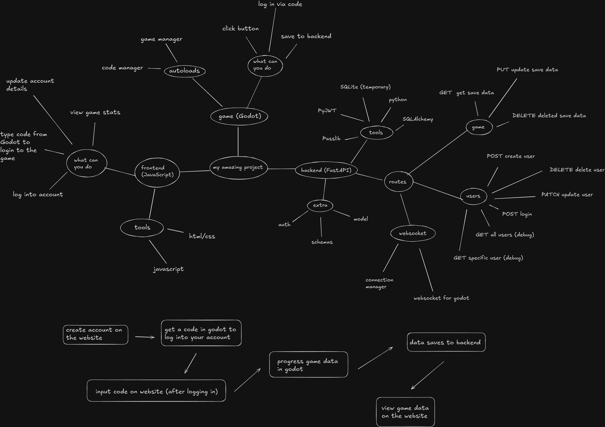

# Biscuit Backend
This is the Server of the 'Biscuit' Project.

Diagram of the project created just before the project began development.

Development notes: [NOTES.md](NOTES.md). Includes sections on challenges solved, decsions made etc.

---

### Repositories
[Game](https://github.com/yaseen-ahmed26/biscuit-game.git) | [Website](https://github.com/yaseen-ahmed26/biscuit-website.git)

---

### Tech
- **Language**: Python 3.12.3

- **Framework**: FastAPI

- **Database**: SQLite (temporary)

- **ORM**: SQLAlchemy

---

### About
This is the backend that handles user account creation, account linking and managing game saves.

Routes:
- **users**: Account creation, deletion, updates and login.

- **saves**: Fetch game data as well as updating game saves.

- **codes**: Manages websocket connections between the Server and Godot. Verifies codes entered by the user.

---

### Future Features

Technical:
- **Refresh Tokens**: Currently the user gets logged out every 30 minutes. Refresh tokens persist and allows the users to stay in longer.

- **JWT Tokens for Godot**: To get or update a user's game save, it passes through the save ID. This is not secure and can be easily intercepted so using a JWT token can be used to verify ownership
.
- **Verify account and reset password emails**: Send various email such as welcome, verify and reset password.

- **PostgreSQL and Alembic**: SQLite is good for development but not for deployment. Alembic is used whenever a new column or table must be added to the database and it will migrate the existing user data.