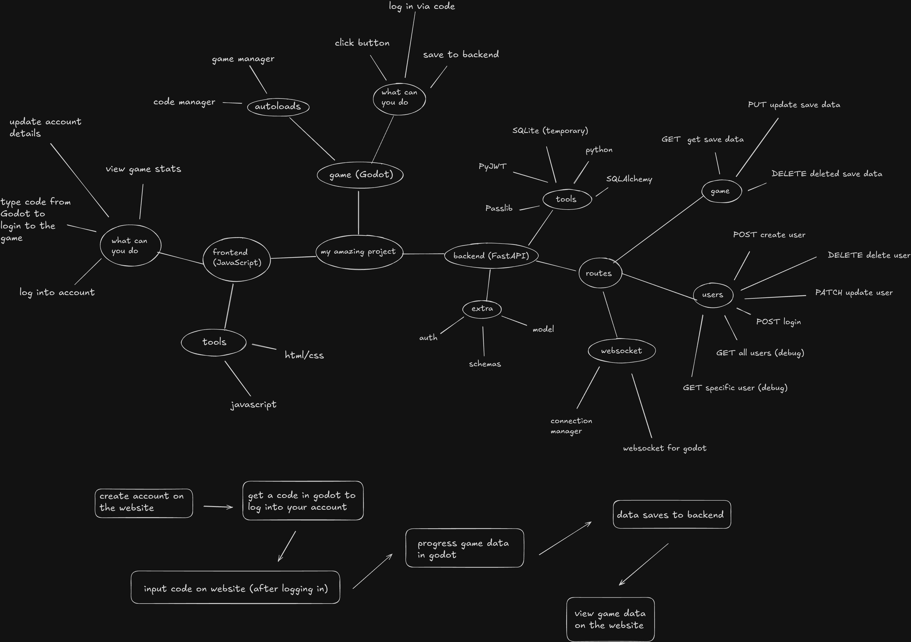

# Biscuit Backend
This is the server for the 'Biscuit' project.

Diagram of the project created before development began.

Development Notes: [NOTES.md](docs/NOTES.md). Challenges solved, decisions made.

Roadmap Notes: [ROADMAP.md](docs/ROADMAP.md). The current v2 plan.

---

### Repositories
[Game](https://github.com/yaseen-ahmed26/biscuit-game) | [Website](https://github.com/yaseen-ahmed26/biscuit-website)

---

### Tech
- **Language**: Python

- **Framework**: FastAPI

- **Database**: SQLite (temporary)

- **ORM**: SQLAlchemy

---

### About
The backend handles:

- **Account creation, updating, deletion**
- **Account linking between the website and the game**
- **Game save management**

Routes:
- **users**: Account creation, deletion, updates and login.

- **saves**: Fetch game data as well as updating game saves.

- **codes**: Manages websocket connections between the Server and Godot. Verifies codes entered by the user.

---

### Future Features

Technical:
- **Refresh Tokens**

- **JWT Tokens for Godot**

- **Verify account and reset password emails**

- **PostgreSQL and Alembic**

More information can be found in roadmap notes.
